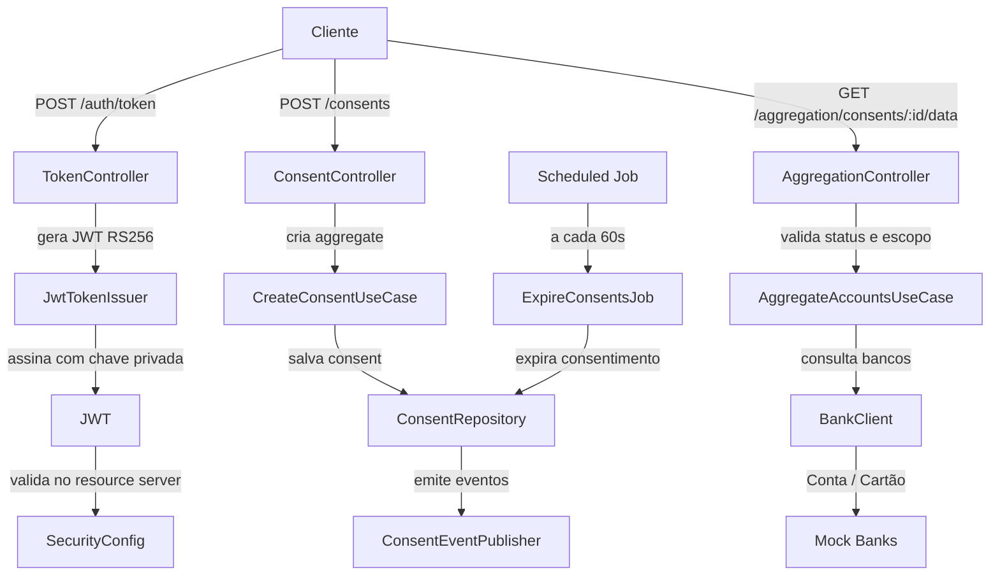

# Open Finance Consent

API de consentimento de dados financeiros, implementada em Java 21 com Spring Boot 4, seguindo princípios de Clean Architecture e arquitetura hexagonal.

O projeto simula um hub de consentimentos Open Finance com autenticação JWT RS256, validação de scopes OAuth2, geração de eventos e agregação de dados multi-banco.

---

## Visão geral

Este serviço expõe um fluxo completo de consentimento para dados financeiros, incluindo:

- criação de consentimento
- autorização e rejeição
- extensão e revogação
- expiração automática
- agregação de contas e cartões por consentimento autorizado
- publicação de eventos de domínio via pattern Outbox
- uso de JWT e scopes para autorização por endpoint

---

## Arquitetura



---

## Stack tecnológica

| Camada | Tecnologia |
|---|---|
| Runtime | Java 21 |
| Framework | Spring Boot 4.0.8 |
| Build | Maven |
| Segurança | Spring Security, OAuth2 Resource Server, JWT RS256 |
| Persistência | Spring Data JPA, H2 (local), PostgreSQL (opcional) |
| Migração | Flyway |
| Testes | JUnit 5, Mockito, Testcontainers |
| Observabilidade | Micrometer + Actuator |
| Agenda | Spring Scheduling |

---

## Requisitos

- Java 21
- Maven 3.9+
- Docker + Docker Compose (opcional, para PostgreSQL)

---

## Como rodar

### 1. Clonar o repositório

```bash
git clone https://github.com/nevvesdev/open-finance-consent.git
cd open-finance-consent
```

### 2. Executar localmente com H2

O projeto já vem configurado com H2 em memória como banco padrão para facilitar o desenvolvimento local.

```bash
./mvnw spring-boot:run
```

A aplicação sobe em:

- https://localhost:8080

Como o projeto usa SSL com certificados autoassinados, o navegador pode mostrar aviso de certificado. Em clientes HTTP como curl, use `--insecure`.

### 3. Rodar PostgreSQL via Docker Compose

```bash
docker compose up -d postgres
```

O arquivo `docker-compose.yml` sobe um PostgreSQL em `localhost:5432` com as credenciais:

- database: `openfinance`
- user: `openfinance`
- password: `openfinance123`

Para usar o PostgreSQL em runtime, basta sobrescrever as propriedades do datasource com variáveis de ambiente ou perfil do Spring:

```bash
SPRING_DATASOURCE_URL=jdbc:postgresql://localhost:5432/openfinance \
SPRING_DATASOURCE_USERNAME=openfinance \
SPRING_DATASOURCE_PASSWORD=openfinance123 \
./mvnw spring-boot:run
```

---

## Segurança

### JWT RS256

O projeto usa JWT assinado com chave privada e validado com chave pública:

- chave privada: `src/main/resources/certs/jwt-private.pem`
- chave pública: `src/main/resources/certs/jwt-public.pem`

A validação do JWT é feita via Spring OAuth2 Resource Server:

```yaml
spring:
  security:
    oauth2:
      resourceserver:
        jwt:
          public-key-location: classpath:certs/jwt-public.pem
```

### Scopes

O projeto usa os scopes:

- `consents:read`
- `consents:write`

Esses scopes são convertidos em authorities com prefixo `SCOPE_`, como:

- `SCOPE_consents:read`
- `SCOPE_consents:write`

---

## Endpoints

### Gerar token de acesso

```bash
curl -X POST "https://localhost:8080/auth/token?clientId=demo-client&scope=consents:write+consents:read" \
  --insecure
```

Resposta:

```json
{
  "access_token": "<jwt>",
  "token_type": "Bearer",
  "expires_in": "3600",
  "scope": "consents:write consents:read"
}
```

### Criar consentimento

```bash
curl -X POST https://localhost:8080/consents \
  -H "Content-Type: application/json" \
  -H "Authorization: Bearer <JWT>" \
  -d '{
    "businessEntityCnpj": "12345678000199",
    "permissions": ["ACCOUNTS_READ", "CREDIT_CARDS_ACCOUNTS_READ"],
    "expirationDateTime": "2026-12-31T23:59:59-03:00"
  }' \
  --insecure
```

### Buscar consentimento por id

```bash
curl -X GET https://localhost:8080/consents/<uuid> \
  -H "Authorization: Bearer <JWT>" \
  --insecure
```

### Autorizar consentimento

```bash
curl -X PATCH https://localhost:8080/consents/<uuid>/authorise \
  -H "Authorization: Bearer <JWT>" \
  --insecure
```

### Rejeitar consentimento

```bash
curl -X PATCH https://localhost:8080/consents/<uuid>/reject \
  -H "Authorization: Bearer <JWT>" \
  -H "Content-Type: application/json" \
  -d '{"reason":"Cliente recusou"}' \
  --insecure
```

### Revogar consentimento

```bash
curl -X DELETE "https://localhost:8080/consents/<uuid>?reason=Revogado%20pelo%20usuario" \
  -H "Authorization: Bearer <JWT>" \
  --insecure
```

### Extender consentimento

```bash
curl -X POST https://localhost:8080/consents/<uuid>/extends \
  -H "Authorization: Bearer <JWT>" \
  -H "Content-Type: application/json" \
  -d '{"newExpirationDateTime":"2027-06-30T23:59:59-03:00"}' \
  --insecure
```

### Agregar dados por consentimento

```bash
curl -X GET https://localhost:8080/aggregation/consents/<uuid>/data \
  -H "Authorization: Bearer <JWT>" \
  --insecure
```

A resposta inclui os dados autorizados pelo consentimento, conforme as permissões vinculadas ao consentimento e ao status do mesmo.

---

## Fluxo de consentimento

Os estados do domínio seguem a máquina de estados abaixo:

- `AWAITING_AUTHORISATION`
- `AUTHORISED`
- `REJECTED`
- `REVOKED`
- `EXPIRED`

A lógica de transição é implementada no aggregate `Consent`, e a publicação de eventos é disparada quando o status muda.

---

## Outbox e eventos

O projeto usa um padrão de Outbox para garantir consistência entre:

- alteração de estado do consentimento
- publicação de eventos de domínio
- processamento assíncrono em fila/relay

A expiração automática também dispara eventos de mudança de status.

---

## Expiração automática

O job `ExpireConsentsJob` executa periodicamente e marca consentimentos vencidos como `EXPIRED`.

Configuração padrão:

```yaml
jobs:
  expire-consents:
    delay-ms: 60000
```

---

## Observabilidade

O projeto expõe endpoints do Actuator, incluindo:

```bash
curl https://localhost:8080/actuator/health --insecure
curl https://localhost:8080/actuator/metrics --insecure
```

A configuração atual expõe:

- `health`
- `info`
- `prometheus`
- `metrics`

---

## Testes

Para rodar a suíte:

```bash
./mvnw test
```

Para rodar um teste específico:

```bash
./mvnw test -Dtest=ConsentTest
./mvnw test -Dtest=ConsentIntegrationTest
```

Também há suporte para geração de cobertura com JaCoCo:

```bash
./mvnw jacoco:report
```

Relatório em:

```text
target/site/jacoco/index.html
```

---

## CI/CD

O repositório inclui workflow de CI em:

```text
.github/workflows/ci.yml
```

Ele executa:

- build com Maven
- testes automatizados
- geração de relatório de cobertura
- execução com PostgreSQL em container

---

## Troubleshooting

### Erro de certificado SSL

Use `--insecure` em clientes como curl.

```bash
curl --insecure https://localhost:8080/consents
```

### JWT inválido

Verifique se o token foi emitido com a chave privada correta e se o cliente usa a mesma chave pública configurada no servidor.

### 403 Forbidden

Normalmente isso indica que o token não contém o scope necessário para a rota acessada.

Exemplo:

- `POST /consents` exige `SCOPE_consents:write`
- `GET /consents/**` exige `SCOPE_consents:read`

---

## Estrutura relevante do projeto

```text
src/main/java/
  br/com/nevvesdev/openfinance/
    adapter/
      in/web/controller/
      out/security/
      out/persistence/
    application/
    config/
    domain/
```

---

## 👨‍💻 Desenvolvido por

João Victor · [GitHub](https://github.com/nevvesdev) · [LinkedIn](https://www.linkedin.com/in/nevvesdev/)

---


## 📄 Licença

MIT License — Veja `LICENSE` para detalhes.